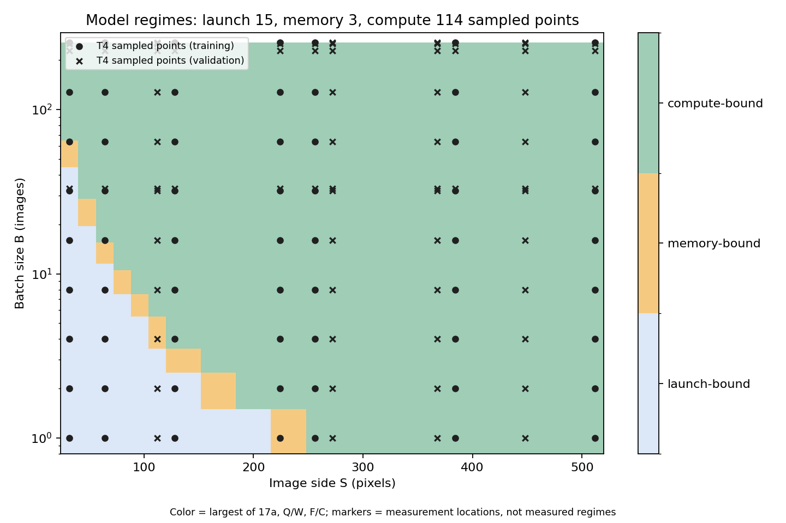

# Домашняя работа 1

Замеры сделаны в Google Colab на NVIDIA Tesla T4: 132 конфигурации,
из них 63 для калибровки и 69 для проверки. Результаты, коэффициенты и девять
графиков находятся в `results/`, рукописные выводы — в `hw1_handwritten.pdf`.

## Запуск

Нужны Python 3.10+, PyTorch с CUDA и NVIDIA T4 без других запущенных задач.
Из каталога `hw1`:

```bash
python -m pip install 'numpy>=1.24' 'scipy>=1.10' 'matplotlib>=3.7' 'torch>=2.2' 'nvidia-ml-py>=12'
python -B measure.py --output results_new
python -B calibrate.py --results results_new
```

Для повторного запуска выбирайте новый каталог: существующий CSV не перезаписывается.
Для пересоздания графиков и калибровки по сохранённым измерениям:

```bash
python -B calibrate.py --results results
```

## Измерения

Сеть работает в FP32, `eval()` и `inference_mode()`. Все свёртки и линейные слои
с `bias=False`, ReLU — с `inplace=True`. BatchNorm нет.
`cudnn.benchmark`, `cudnn.allow_tf32` и `cuda.matmul.allow_tf32` отключены.

Входы — случайные тензоры. Проверены 11 размеров изображения × 12 размеров батча
при `seed=2026`. Проверочные точки не участвуют в подборе коэффициентов.

- Время: медиана 30 синхронизированных замеров после 10 прогревочных проходов
- Память: `torch.cuda.max_memory_allocated()` за один проход после прогрева
- Энергия: прирост счётчика NVML за не менее чем три секунды повторных проходов,
  делённый на их число; при недоступности счётчика интегрируется мощность

## Формулы и допущения

`S` — сторона квадратного изображения в пикселях, `B` — число изображений в батче.

- FLOPs: `B * (17714 * S**2 + 313344)`
- Память: `4159872 + 104 * B * S**2 + 3472 * B` байт
- Объём обмена с памятью: `364 * B * S**2 + 8592 * B + 4159872` байт
- Время: `17 * a + max(total_FLOPs / C, total_bytes / W)` секунд
- Энергия: `p * predicted_latency + epsilon_F * FLOPs + epsilon_Q * bytes_moved` джоулей

Умножение с накоплением считается за 2 FLOPs, сравнения ReLU и MaxPool не учитываются.
GlobalAvgPool выполняет `H*W-1` сложений и одно деление на канал и изображение.
Один элемент FP32 занимает 4 байта. Память оценивается
как сумма весов, входа и всех активаций; ReLU на месте и flatten не добавляют хранения.
Обмен с памятью предполагает однократное чтение входов и весов и запись выхода
каждого оператора, без учёта кэша между операторами и рабочей памяти библиотек.

`a` измеряется в секундах на логический оператор, `C` — во FLOP/с, `W` — в байт/с.
Энергетические коэффициенты имеют единицы Вт, Дж/FLOP и Дж/байт.

## Графики

На графиках времени, памяти и энергии чёрная линия — предсказание, синие точки —
замеры для калибровки, оранжевые крестики — для проверки. Каждая панель соответствует
одному размеру изображения, по горизонтали — размер батча.

FLOPs проверены по формам тензоров реальной CNN с помощью хуков и метатензоров.
Это подсчёт операций сети, а не измерение аппаратными счётчиками GPU.

- [FLOPs](results/figures/flops_grid.png)
- [Время](results/figures/latency_grid.png) и [диаграмма соответствия](results/figures/latency_parity.png)
- [Память](results/figures/memory_grid.png) и [диаграмма соответствия](results/figures/memory_parity.png)
- [Энергия](results/figures/energy_grid.png) и [диаграмма соответствия](results/figures/energy_parity.png)
- [OOM](results/figures/oom_grid.png)
- [Карта режимов](results/figures/regime_map.png): цвет показывает преобладающий член модели, маркеры — точки замеров

<!-- environment:start -->
## Окружение

| Компонент | Значение |
|---|---|
| GPU | NVIDIA Tesla T4 |
| Драйвер | 580.82.07 |
| Python | 3.13.15 |
| PyTorch | 2.11.0+cu128 |
| CUDA | 12.8 |
| cuDNN | 91900 |

<!-- environment:end -->

<!-- metrics:start -->
## Результаты

MAPE — средняя абсолютная относительная ошибка.

| Величина | Калибровка, MAPE | Проверка, MAPE |
|---|---:|---:|
| Время | 22,20% | 23,78% |
| Память | 27,56% | 17,96% |
| Энергия | 17,11% | 20,57% |

Все 132 конфигурации выполнились без ошибок и OOM.
<!-- metrics:end -->

## Анализ результатов

По графикам видно, что формула времени не одинаково хорошо работает на всей
сетке. Средняя ошибка на проверке — 23,78%, но в отдельных точках она намного
больше. Например, для `S=272, B=2` получается 1,360 мс вместо измеренных
0,755 мс — завышение на 80,18%. Поэтому одной средней ошибки здесь мало:
на графиках по батчу лучше видно, где именно предсказание расходится с замерами.

В формуле одна скорость вычислений и одна пропускная способность на всю сеть.
После подбора получились `C = 2,57 TFLOP/с`, `W = 61,98 ГБ/с` и
`a = 19,94 мкс` на операцию. Это параметры нашей модели времени.
Они не учитывают, что для разных форм тензоров cuDNN может выбирать разные
алгоритмы, а свёртки и ReLU по-разному нагружают GPU. Общий
`max(F/C, Q/W)` тоже упрощает ситуацию: слои идут последовательно и могут
упираться в разные ресурсы. Без профилирования нельзя сказать, какой из этих
эффектов дал ошибку в конкретной точке.

Чтобы посмотреть на режимы, для каждой пары `(S, B)` сравнили `17a`, `F/C`
и `Q/W`. Получилось 15 точек с преобладанием накладных расходов запуска,
3 — обмена с памятью и 114 — вычислений. Маркеры на карте показывают, где
были сделаны замеры; цвет рассчитан по формуле. Сами режимы аппаратно не измерялись.



Постоянная часть времени равна `17a = 0,339 мс`. На маленьких задачах это
заметная доля прохода. Например, при `S=32` увеличение батча с 1 до 16
не увеличило время: измерено 0,572 и 0,467 мс соответственно.
Такое поведение согласуется с большой ролью накладных расходов, хотя
само по себе не доказывает, что всё время уходит на запуск кернелов.
Число 17 — количество логических операций сети; CUDA-кернелов может быть больше.

Область memory-bound на карте узкая. По подобранным коэффициентам вычислительный
член становится больше члена памяти при `F/Q > C/W ≈ 41,4 FLOP/байт`.
При больших изображениях и батчах `F/Q` приближается к 48,7 FLOP/байт,
поэтому большая часть сетки попадает в compute-bound. Здесь memory-bound
означает ограничение скорости обмена, а не нехватку памяти для размещения тензоров.

С памятью расхождения устроены иначе. Формула складывает веса, вход и все активации. При реальном проходе часть тензоров
уже освобождена, зато появляются временные буферы библиотек. Эти эффекты
действуют в разные стороны, поэтому сумма активаций не гарантирует ни верхнюю,
ни нижнюю оценку пика. При `S=112, B=1` формула даёт 5,47 МБ, а замер —
22,46 МБ: ошибка 75,66%, хотя средняя ошибка на проверке составляет 17,96%.
Максимальный измеренный пик на всей сетке — 6,17 ГБ. OOM не было ни в замерах,
ни в предсказаниях, так что проверить границу нехватки памяти не получилось.
МБ и ГБ здесь десятичные.

Для энергии средняя ошибка на проверке — 20,57%. После калибровки формула
свелась к `E ≈ 62,69 · T_predicted`: коэффициенты при FLOPs и байтах стали
нулевыми. Вычисления и обращения к памяти, конечно, расходуют энергию,
но по этой сетке их отдельную стоимость определить не получилось:
время, число операций и трафик меняются вместе. Поэтому 62,69 Вт нельзя
считать измеренной мощностью простоя GPU.

Самая большая относительная ошибка энергии получилась при `S=32, B=252`:
0,135 Дж вместо 0,306 Дж, то есть 55,92%. Здесь предсказание энергии напрямую
зависит от предсказания времени. Дополнительно модель считает коэффициент
мощности постоянным, хотя загрузка GPU меняется. NVML при этом учитывает
энергию всей GPU за серию проходов, включая паузы между ними.

В итоге точное совпадение получилось только для FLOPs — с подсчётом операций
по слоям на всех 132 точках. Время, память и энергия оцениваются приближённо.
Для сравнения затрат при разных размерах входа формулы полезны, но отдельные
ошибки заметно выше среднего, особенно на небольших задачах.
